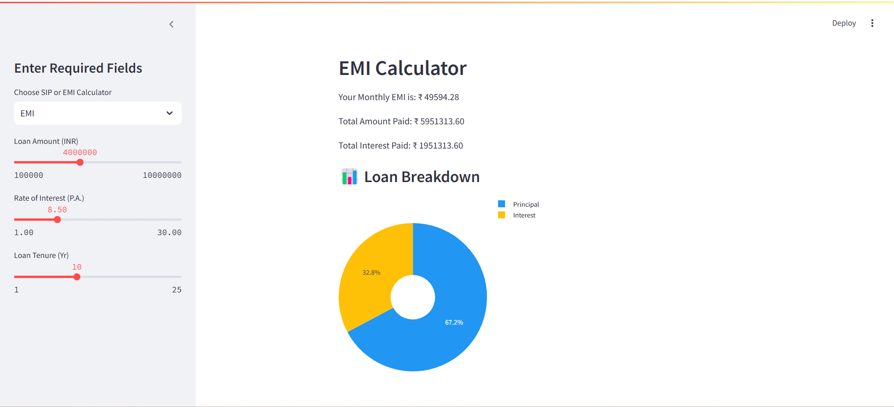

# 💰 SIP & EMI Calculator (Streamlit App)

This project is a simple, interactive **SIP and EMI calculator** built using **Python and Streamlit**. It helps users calculate:

- 📈 Monthly EMI based on loan details  
- 💸 Future returns based on SIP investments  
- 📊 Visual pie charts to understand principal vs. interest breakdown

---

## 🚀 Features

- Easy-to-use Streamlit UI
- EMI calculation based on loan amount, tenure, and interest rate
- SIP calculation based on monthly investment, rate of return, and investment period
- Pie chart visualizations using Plotly
- Modular structure with class-based calculations
- Sidebar selectbox to toggle between calculators

---

## 📦 Folder Structure

```
SIP-EMI-Calculator/
│
├── app.py                    # Main Streamlit app with selectbox
├── calculators/
│   ├── __init__.py
│   ├── class_emi.py          # EMI calculation class
│   └── class_sip.py          # SIP calculation class
├── requirements.txt
└── README.md
```

---

## 🧮 Formulas Used

### EMI Formula

EMI = [P x R x (1+R)^N] / [(1+R)^N – 1]
Where:
P = Principal
R = Monthly Interest Rate
N = Number of Monthly Installments

### SIP Future Value Formula

FV = P × [ (1 + r)^n – 1 ] × (1 + r) / r
Where:
P = Monthly Investment
r = Monthly Return Rate
n = Total Months

---

## 🛠️ Tech Stack

- Python 🐍  
- Streamlit 📊  
- Plotly for charts 📈  
- VS Code for development 💻  

---

## ▶️ How to Run Locally

1. Clone the repo:

    git clone https://github.com/NishantSuhag02/sip-emi-calculator.git
    cd sip-emi-calculator

2. Install dependencies:

    pip install -r requirements.txt

3. Run the app:

    streamlit run app.py

---

## 📸 Screenshots



---


## 🙌 Acknowledgements

Thanks to the Streamlit and Plotly community for amazing tools!

